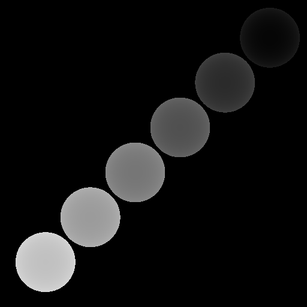
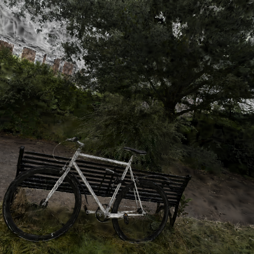

# illuminator


Illuminator is a simple yet powerful rendering tool.


## Usage

### Use as cli

```Bash
./illu -e 3dgs --path "..\bicycle.ply" --res "256x256"
```

### Use as lib

```Rust
#[test]
fn test_trace_splats() -> Result<()> {
    use crate::{prelude::*, splat::render::SplatsRenderer};
    use std::path::Path;

    let ply_path = "./target/bicycle.ply";
    let rdr = SplatsRenderer::from_ply(ply_path)?;

    let mut cam = Camera::default();
    cam.pos = Vec3f::vec([-3., 0., 0.]);
    cam.look_at(Vec3f::zero());

    let (w, h) = (256, 256);
    let img = rdr.render(&cam, (w, h));

    let png_path = Path::new(ply_path)
        .with_extension("png")
        .to_string_lossy()
        .into_owned();

    let rgbimg = RgbImage::from(img);
    rgbimg.save(png_path).expect("Failed to save trace image");
    Ok(())
}
```


## examples

- Simple and flexible Linear BVH.




- Ray tracing 3D Gaussians. 


